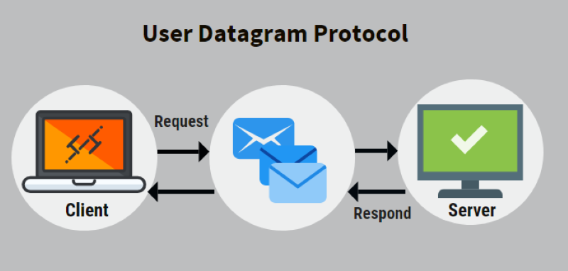

# Java网络编程练习

## TCP

- [BIO](src/org/example/tcp/bio)
- [NIO](src/org/example/tcp/nio)
- [AIO](src/org/example/tcp/aio)

## UDP

- [UDP](src/org/example/udp)

## 说明
- 想要同时运行多个Client，要在IDEA的Run设置里进行调节！
